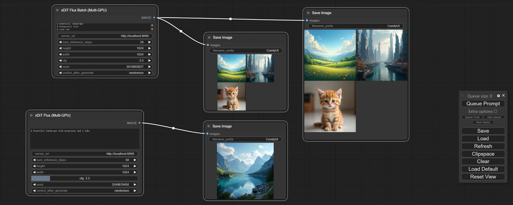

#### 0.将本文件夹comfyui-xdit 拷贝到comfyui/custom_nodes


#### 1.启动server 服务

```
cd comfyui/custom_nodes/comfyui-xdit
bash start_server.sh /path/to/FLUX.1-dev PORT GPU_NUM

# 例如：
bash start_server.sh /data3t/ckpt/black-forest-labs/FLUX.1-dev 6000 2
```

#### 2.启动comfyUI

```
cd comfyui
python3 main.py --disable-cuda-malloc --port 8187 --force-fp16 --disable-xformers --listen 0.0.0.0
```

#### 3.操作comfyUI界面

1. 右键 -> Add Node -> xDit -> xDit Flux
2. 右键 -> Add Node -> image -> Save Image 
3. 将两个节点连接起来


